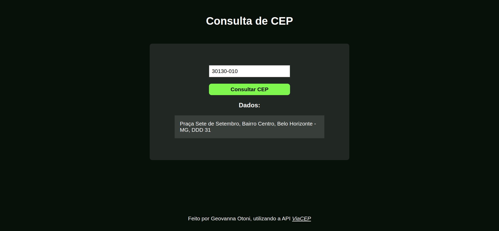

# Consulta de CEP
A aplicação que exibe o endereço com base em um CEP passado pela pessoa usuária, a partir da API ViaCEP.

## :computer: Visualize este projeto:
Acesse a página aqui:
[https://geovannaotoni-consulta-cep.surge.sh/](https://geovannaotoni-consulta-cep.surge.sh/)

## :bulb: Habilidades:
Feito a partir dos conhecimentos de CSS, HTML, JavaScript, DOM, Eventos, API, NPM, Vite, Promisses, Fetch, Async e Await.